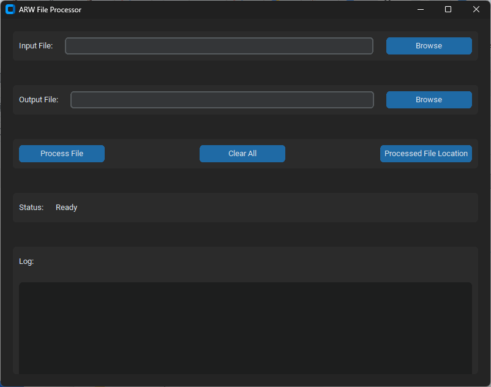

# 🛠️ ARW Zeros Fixer

### Automated CSV Data Cleaning & Validation Tool

A desktop Python application designed to clean and standardize **ARW dealer acknowledgment CSV files** before they're reloaded or sent downstream.

The application provides a simple graphical interface for selecting an input file, applying standardized data transformations, generating a cleaned output file, and reviewing processing activity through an integrated log.

## 📸 Application Preview

[](./ARW_File_Fixer_Thumbnail.png)

---

## 🎯 The Problem

CSV files used in operational data workflows can contain inconsistent or placeholder values that create downstream processing issues.

Examples include:

* `"0"` appearing where an empty value is expected
* State names appearing in different formats
* Contract prices containing zero values that require correction
* Refund amounts requiring specific values based on transaction reason
* Manual file-cleaning steps that are repetitive and error-prone

The goal of this project is to **standardize these transformations into a repeatable process** rather than relying on manual edits.

---

## 💡 The Solution

**ARW Zeros Fixer** provides a desktop GUI that allows a user to:

1. Select an input CSV file
2. Automatically generate a default output filename
3. Apply predefined data-cleaning rules
4. Save the transformed data as a new CSV
5. View processing status and activity
6. Open the output directory directly from the application

The application preserves the input records and column structure while modifying specific field values according to defined business rules.

---

# 🔄 How It Works

```text
              INPUT CSV
                  │
                  ▼
        ┌──────────────────┐
        │  Read CSV File   │
        └────────┬─────────┘
                 │
                 ▼
        ┌──────────────────┐
        │ Zero → Empty     │
        │ Conversion       │
        └────────┬─────────┘
                 │
                 ▼
        ┌──────────────────┐
        │ State            │
        │ Standardization  │
        └────────┬─────────┘
                 │
                 ▼
        ┌──────────────────┐
        │ Contract Price   │
        │ Correction       │
        └────────┬─────────┘
                 │
                 ▼
        ┌──────────────────┐
        │ Refund Amount    │
        │ Correction       │
        └────────┬─────────┘
                 │
                 ▼
        ┌──────────────────┐
        │ Write Output CSV │
        └────────┬─────────┘
                 │
                 ▼
             CLEAN FILE
```

---

# 🧹 Data Transformations

## 1. Zero-to-Empty Conversion

Specific fields containing the literal string `"0"` are converted to empty strings.

Fields include:

* `Cancellation_Date`
* `Cancel_Reason_Code`
* `Business_Name`
* `Customer_Address_2`
* `Customer_Phone`
* `Customer_Email`
* `Sales_Ticket_Number`
* `Manufacturer_Name`
* `Model_Number`
* `Model_Name`
* `Serial_Number`
* `Product_Condition`
* `Contract_Note`
* `Renewal_Contract_Number`
* `Change_Flag`
* `Original_Contract_Number`

---

## 2. State Standardization

The application standardizes the `Customer_State` field.

It handles:

* Existing two-letter state abbreviations
* Full state names
* Mixed or lowercase values
* Other values that need capitalization

For example:

```text
kentucky → KY
KY       → KY
ohio     → OH
```

The application includes a built-in lookup table containing the 50 states plus Washington, D.C.

---

## 3. Contract Price Correction

If `Contract_Price_Retail_Cost` evaluates numerically to zero, the application changes the value to:

```text
1
```

Values such as `0` and `0.0` are handled, while non-numeric values are left unchanged.

---

## 4. Refund Amount Correction

For records where `Transaction_Reason` is:

```text
1
2
5
```

the application sets:

```text
Contract_Refund_Amount = 0
```

These transaction reason codes are maintained in the centralized `ZERO_REFUND_REASON_CODES` configuration.

---

# 🖥️ Application Features

The application includes:

* 📁 Input file selection
* 💾 Output file selection
* ▶️ Process File
* 🧹 Clear All
* 📂 Processed File Location
* 📊 Processing status
* 📝 Integrated activity log
* ⚠️ Error handling

The default output filename is automatically generated from the input filename using the `_Fix` suffix.

---

# 🧱 Architecture

The application is separated into four primary components:

| Component             | Responsibility                          |
| --------------------- | --------------------------------------- |
| `FileHandler`         | Reads and writes CSV files              |
| `RecordProcessor`     | Applies individual data transformations |
| `ARWFileProcessor`    | Coordinates the processing workflow     |
| `ARWFileProcessorGUI` | Provides the desktop user interface     |

This separation keeps file operations, transformation logic, workflow orchestration, and UI functionality distinct.

---

# 🧰 Technologies

* 🐍 Python
* 🖥️ Tkinter
* 🎨 CustomTkinter
* 📄 CSV
* 📝 Python Logging
* 📦 Python Standard Library

---

# 🚀 Getting Started

## Requirements

Python 3.x and CustomTkinter.

Install the required package:

```bash
pip install customtkinter
```

## Run the Application

```bash
python ARW_zeros_v9.2.py
```

This launches the **ARW File Processor** desktop application.

---

# 📋 Usage

### Step 1 — Select the Input

Click **Browse** and select the source CSV file.

The application automatically creates a default output path using:

```text
{input_name}_Fix.csv
```

### Step 2 — Process the File

Click **Process File**.

The application:

```text
Read → Transform → Write
```

the records.

### Step 3 — Review the Output

Once processing completes, the application displays the number of records processed and provides access to the output location.

### Step 4 — Reset

Use **Clear All** to reset the application and begin another processing run.

---

# 📝 Logging & Error Handling

Each run records information such as:

* Number of records read
* Number of records processed
* Output location
* Processing errors

Logs are written to:

```text
arw_processor.log
```

and are also displayed within the application's log panel.

---

# 💼 Business Value

This project demonstrates how a manual data-cleaning workflow can be converted into a **repeatable desktop automation tool**.

### ⚙️ Standardization

Business rules are implemented consistently rather than manually applied to individual files.

### 🔁 Repeatability

The same transformations can be applied to each file processed through the application.

### 🧹 Data Quality

Common formatting and placeholder-value issues are addressed before downstream use.

### 🖥️ Accessibility

A GUI allows users who aren't comfortable running Python scripts from the command line to operate the process.

### 🔍 Traceability

Processing activity and errors are captured through application logging.

---

# 🧠 What This Project Demonstrates

This project demonstrates experience with:

* Object-oriented Python
* GUI application development
* CSV data processing
* Data transformation
* Business-rule implementation
* Error handling
* Logging
* File-system operations
* Configuration-driven processing
* Workflow automation

---

# 🔧 Customization

Several business rules are centralized so they can be modified without changing the core processing workflow.

### Zero-to-empty fields

```python
ZERO_TO_EMPTY_FIELDS
```

Controls which fields convert `"0"` to an empty value.

### Refund reason codes

```python
ZERO_REFUND_REASON_CODES
```

Controls which transaction reasons force the refund amount to zero.

### State mappings

```python
STATE_ABBREVIATIONS
```

Contains the state-name-to-abbreviation mappings.

---

# 🚧 Future Improvements

* [ ] Add automated unit tests
* [ ] Add CSV validation before processing
* [ ] Add a processing summary report
* [ ] Add before/after record statistics
* [ ] Add configurable business rules through the GUI
* [ ] Add drag-and-drop file support
* [ ] Add batch processing for multiple CSV files
* [ ] Package the application as a standalone Windows executable
* [ ] Add automated test data
* [ ] Add additional data-quality validation rules

---

# 👨🏾‍💻 Author

**Antonio Nunnally**

Data & Business Analyst

**Focus Areas**

`Python` • `Data Analytics` • `Automation` • `AI` • `Business Intelligence`

---

> **Build systems that eliminate repetitive work.**
>
> The goal isn't simply to write code. It's to use technology to make business processes more consistent, efficient, and scalable.
